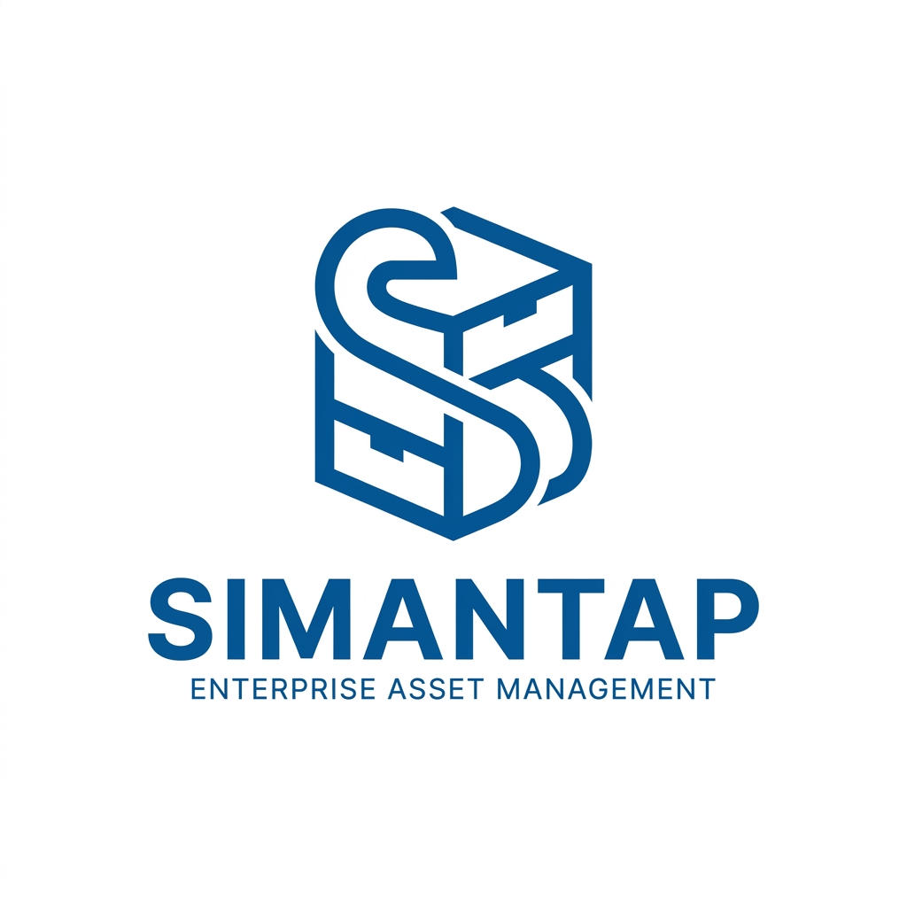

<div align="center">
  
  <h1 align="true">SIMANTAP</h1>
  <p align="true"><strong>Sistem Informasi Manajemen Inventaris Barang</strong></p>
  <p>
    Aplikasi manajemen inventaris berbasis web untuk multi-lokasi — laboratorium, gudang, kantor, ruang kelas, dan lainnya. Dibangun dengan Laravel 13, Livewire 3, Tailwind CSS, Alpine.js, dan MySQL.
  </p>
</div>

---

## Daftar Isi

- [Fitur Utama](#fitur-utama)
- [Teknologi](#teknologi)
- [Persyaratan Sistem](#persyaratan-sistem)
- [Instalasi di Laragon](#instalasi-di-laragon)
- [Akun Default](#akun-default)
- [Struktur Database](#struktur-database)
- [Modul & Fitur Detail](#modul--fitur-detail)
- [Route & Halaman](#route--halaman)
- [Role & Permission](#role--permission)
- [API / Service](#api--service)
- [Lisensi](#lisensi)

---

## Fitur Utama

| Fitur | Keterangan |
|-------|------------|
| **Multi-Lokasi** | Mendukung berbagai tipe lokasi (lab, gudang, kantor, ruang_kelas) dengan struktur hirarki parent/child |
| **Kategori & Sub-kategori** | Kategori barang bertingkat dengan slug otomatis dan dukungan ikon |
| **Template Barang** | Template predefined untuk standarisasi barang (merk, model, spesifikasi, estimasi harga) |
| **Manajemen Barang/Aset** | CRUD lengkap dengan QR Code otomatis, nomor seri unik, tracking kondisi & status penggunaan |
| **Manajemen Stok** | Stok gudang/sparepart dengan ambang batas minimum dan deteksi stok menipis otomatis |
| **Mutasi Stok** | Stok masuk, stok keluar, dan transfer antar lokasi |
| **Riwayat Perbaikan** | Tracking perbaikan/maintenance dengan tingkat kerusakan, biaya, penangan internal/eksternal |
| **Komponen Barang** | Bill-of-materials: barang induk dapat memiliki komponen barang |
| **Riwayat Status Barang** | Audit trail perubahan kondisi, status, dan lokasi barang |
| **Import Excel** | Import massal data barang dari Excel/CSV dengan template download |
| **Export Laporan** | Export PDF (DomPDF) dan Excel (Laravel Excel) dengan filter fleksibel |
| **Dashboard Analytics** | Grafik kondisi barang (doughnut) dan barang per lokasi (bar) menggunakan Chart.js |
| **Role-Based Access Control** | 4 role + 30+ permission menggunakan Spatie Laravel Permission |
| **Activity Log** | Audit trail lengkap untuk semua operasi menggunakan Spatie Activitylog |
| **Mode Gelap (Dark Mode)** | Toggle dark mode dengan persistensi ke localStorage |
| **Backup & Restore Database** | Backup/restore MySQL via panel Developer (mysqldump) |
| **Notifikasi** | Notifikasi database untuk stok menipis |
| **Verifikasi Email** | Auth dengan email verification (Laravel Breeze) |
| **Lokal Indonesia** | Seluruh antarmuka dalam Bahasa Indonesia |

---

## Teknologi

### Backend

| Package | Versi |
|---------|-------|
| PHP | ^8.3 |
| Laravel | ^13.18 |
| Livewire | ^3.6 |
| Livewire Volt | ^1.7 |
| Spatie Laravel Permission | ^8.3 |
| Spatie Activitylog | ^5.0 |
| Laravel Excel (Maatwebsite) | ^3.1 |
| Laravel DomPDF (Barryvdh) | ^3.1 |
| Simple QR Code | ^4.2 |
| Laravel Breeze | ^2.4 (Livewire stack) |

### Frontend

| Package | Versi |
|---------|-------|
| Alpine.js | ^3.15 |
| Chart.js | ^4.5 |
| Tailwind CSS | ^3.1 |
| Vite | ^8.0 |
| PostCSS | ^8.4 |

---

## Persyaratan Sistem

- PHP **^8.3**
- Composer **2.x**
- MySQL **8.0+**
- Node.js **18+**
- NPM **9+**
- Laragon **6.0+** (direkomendasikan untuk Windows)
- Ekstensi PHP: `pdo_mysql`, `gd`, `zip`, `xml`, `mbstring`, `bcmath`, `json`, `fileinfo`
- `mysqldump` & `mysql` CLI (untuk fitur backup/restore database)

---

## Instalasi di Laragon

### 1. Clone repositori

```bash
git clone <repository-url> simantap
cd simantap
```

### 2. Install dependensi PHP

```bash
composer install
```

### 3. Konfigurasi environment

```bash
copy .env.example .env
```

Edit file `.env` dan sesuaikan:

```env
APP_NAME=SIMANTAP
APP_URL=http://simantap.test
APP_LOCALE=id

DB_CONNECTION=mysql
DB_HOST=127.0.0.1
DB_PORT=3306
DB_DATABASE=simantap
DB_USERNAME=root
DB_PASSWORD=

SESSION_DRIVER=database
QUEUE_CONNECTION=database
CACHE_STORE=database
```

### 4. Generate application key

```bash
php artisan key:generate
```

### 5. Buat database

Buat database MySQL baru bernama `simantap` melalui Laragon MySQL > Console, atau:

```sql
CREATE DATABASE simantap CHARACTER SET utf8mb4 COLLATE utf8mb4_unicode_ci;
```

### 6. Jalankan migrasi dan seeder

```bash
php artisan migrate --seed
```

Perintah ini akan menjalankan 7 seeder secara berurutan:

1. `RolePermissionSeeder` — membuat 4 role, 30+ permission, dan 4 user default
2. `SettingSeeder` — pengaturan aplikasi
3. `LocationSeeder` — data lokasi contoh
4. `CategorySeeder` — data kategori contoh
5. `ItemTemplateSeeder` — data template contoh
6. `ItemSeeder` — data barang contoh
7. `StockSeeder` — data stok contoh

### 7. Install dependensi NPM

```bash
npm install
```

### 8. Build frontend

```bash
npm run build
```

### 9. Buat symlink storage

```bash
php artisan storage:link
```

### 10. Jalankan aplikasi

**Production mode:**

```bash
php artisan serve
```

**Development mode (dengan Vite hot reload):**

```bash
npm run dev
```

Akses di `http://simantap.test` atau `http://127.0.0.1:8000`.

> **Catatan untuk fitur Backup Database:** Pastikan `mysqldump` dan `mysql` CLI tersedia di PATH sistem. Laragon sudah menyertakan kedua binary ini di `C:\laragon\bin\mysql\mysql-8.0.30-winx64\bin\`.

---

## Akun Default

| Role | Email | Password |
|------|-------|----------|
| **Super Admin** | superadmin@simantap.test | password |
| **Admin** | admin@simantap.test | password |
| **Staff** | staff@simantap.test | password |
| **Pimpinan** | pimpinan@simantap.test | password |

---

## Struktur Database

Aplikasi memiliki **17 tabel migrasi** + **6 tabel package**:

### Tabel Aplikasi (11)

| Tabel | Deskripsi | Kolom Kunci |
|-------|-----------|-------------|
| `settings` | Pengaturan aplikasi key-value | `key` (unique), `value`, `group` |
| `locations` | Data lokasi (hirarkis) | `kode_lokasi` (unique), `nama`, `tipe_lokasi`, `parent_id`, `penanggung_jawab_id`, `kapasitas`, `is_active`, softDeletes |
| `categories` | Kategori barang (hirarkis) | `nama`, `slug` (unique), `parent_id`, `icon`, `is_active`, softDeletes |
| `item_templates` | Template barang | `nama`, `merk`, `tipe_model`, `satuan`, `kategori_id`, `estimasi_harga`, `has_serial_number`, `is_active`, softDeletes |
| `items` | Barang/aset utama | `kode_aset` (unique), `nama`, `kategori_id`, `lokasi_id`, `item_template_id`, `parent_id`, `nomor_seri` (unique), `kondisi`, `status_penggunaan`, `harga`, `qr_code`, softDeletes |
| `item_components` | Komponen barang (BOM) | `parent_item_id`, `component_item_id`, `kuantitas`, `catatan` |
| `stocks` | Stok gudang/sparepart | `nama`, `kategori_id`, `lokasi_id`, `jumlah_stok`, `ambang_batas_minimum`, `satuan`, `harga_satuan`, softDeletes |
| `stock_movements` | Mutasi stok | `stock_id`, `tipe` (masuk/keluar/transfer), `jumlah`, `referensi`, `from/to_location_id` |
| `item_status_histories` | Riwayat perubahan status | `item_id`, `kondisi_sebelumnya`, `kondisi_baru`, `status_baru`, `lokasi_baru_id` |
| `repair_histories` | Riwayat perbaikan | `item_id`, `tingkat_kerusakan`, `biaya`, `tanggal_selesai`, `status_akhir`, softDeletes |
| `location_user` | Relasi many-to-many user-lokasi | `location_id`, `user_id` |

### Tabel Package

| Tabel | Package |
|-------|---------|
| `permissions`, `roles`, `model_has_permissions`, `model_has_roles`, `role_has_permissions` | Spatie Laravel Permission |
| `activity_log` | Spatie Activitylog |

---

## Modul & Fitur Detail

### 1. Dashboard (`/dashboard`)

- **Livewire Component:** `App\Livewire\Dashboard\Index`
- 4 kartu statistik: Total Barang, Total Stok, Perlu Perhatian, Stok Menipis
- Grafik kondisi barang (doughnut chart) — Chart.js
- Grafik barang per lokasi (bar chart) — Chart.js
- Daftar barang rusak belum diperbaiki
- Daftar stok menipis
- Daftar barang terbaru
- Daftar riwayat perbaikan terbaru
- Filter lokasi (untuk Super Admin)

### 2. Lokasi (`/lokasi`)

- **Livewire Components:** `LokasiList`, `LokasiForm`, `LokasiShow`
- Tipe lokasi: laboratory, warehouse, office, classroom, dsb.
- Struktur hirarki parent/child
- Penanggung jawab lokasi (relasi ke User)
- Status aktif/nonaktif
- Kapasitas dan deskripsi

### 3. Kategori (`/kategori`)

- **Livewire Components:** `KategoriList`, `KategoriForm`, `KategoriShow`
- Slug otomatis dari nama
- Struktur parent/child (sub-kategori)
- Ikon kategori
- Soft deletes + restore

### 4. Template Barang (`/template`)

- **Livewire Components:** `TemplateList`, `TemplateForm`, `TemplateShow`
- Standarisasi barang: merk, tipe/model, satuan, spesifikasi
- Relasi ke kategori
- Estimasi harga
- Toggle serial number (has_serial_number)
- Status aktif/nonaktif

### 5. Barang/Aset (`/barang`)

- **Livewire Components:** `BarangList`, `BarangForm`, `BarangShow`, `TandaiRusak`
- Kode aset unik (format: `BRG-001`, `KMP-001`, dll.)
- Nomor seri unik
- QR Code otomatis
- Tracking kondisi: Baik, Rusak Ringan, Rusak Berat, Dalam Perbaikan, Sudah Diperbaiki, Afkir-Dihapuskan
- Tracking status penggunaan: Digunakan, Idle, Dipinjam, Dalam Perbaikan, Menunggu Pembuangan
- Struktur parent/child (barang induk memiliki komponen)
- Bill-of-materials (item components)
- Riwayat perbaikan per barang
- Riwayat perubahan kondisi & status
- Import Excel/CSV massal (dengan template download)
- Tandai rusak (satu langkah ubah kondisi + catat)

### 6. Stok (`/stok`)

- **Livewire Components:** `StokList`, `StokForm`, `StokShow`, `MutasiForm`, `MutasiMasuk`, `MutasiKeluar`
- Stok gudang dan sparepart
- Ambang batas minimum + deteksi stok menipis otomatis (`isLowStock()`)
- Harga satuan
- Mutasi: stok masuk, stok keluar, transfer
- Riwayat mutasi per stok

### 7. Perbaikan (`/perbaikan`)

- **Livewire Components:** `PerbaikanList`, `PerbaikanForm`, `PerbaikanShow`
- Tingkat kerusakan: Ringan, Sedang, Berat, Kritis
- Penangan internal (user) atau eksternal (vendor)
- Tracking biaya perbaikan
- Status akhir: Selesai, Dalam Proses, Menunggu Part, Tidak Dapat Diperbaiki
- Overdue detection (hitung hari tertunda)
- Soft deletes + restore

### 8. Laporan (`/laporan`)

- **Livewire Component:** `LaporanIndex`
- 4 jenis laporan:
  - **Barang per Lokasi** — tabel grup per lokasi
  - **Barang Rusak** — barang dengan kondisi rusak
  - **Stok Gudang** — stok dengan status aman/menipis
  - **Riwayat Perbaikan** — riwayat perbaikan dengan filter
- Filter: lokasi, kategori, kondisi, status, tanggal
- Export **PDF** (DomPDF)
- Export **Excel** (Laravel Excel)

### 9. Pengguna (`/pengguna`)

- **Livewire Components:** `PenggunaList`, `PenggunaForm`, `PenggunaShow`
- Manajemen user + assignment role
- Toggle aktif/nonaktif
- Atribut: nama, email, telepon

### 10. Log Aktivitas (`/log-aktivitas`)

- **Livewire Component:** `LogActivityList`
- Audit trail semua operasi (create, update, delete, view, import, export, login, logout)
- Filter: modul, event, pelaku, tanggal
- Detail popup dengan data perubahan (old/new attributes)
- 20+ event yang di-log dari seluruh modul

### 11. Pengaturan (`/pengaturan`)

- **Livewire Component:** `PengaturanIndex`
- Nama instansi
- Alamat
- Notifikasi stok menipis
- Format kode aset (prefix, separator)

### 12. Developer (`/developer`)

- **Livewire Component:** `DeveloperIndex`
- Informasi sistem (PHP, Laravel, DB version)
- Log error viewer (10 error terbaru dari file log)
- Backup database:
  - Membuat backup (.sql)
  - Download file backup
  - Restore database (dengan konfirmasi RESTORE)
  - Hapus file backup
  - Statistik backup

---

## Route & Halaman

### Route Backend

| Method | URI | Name | Component/Controller |
|--------|-----|------|---------------------|
| GET | `/` | — | Redirect ke `/login` |
| GET | `/dashboard` | `dashboard` | `Dashboard\Index` |
| GET | `/lokasi` | `lokasi.index` | `Lokasi\LokasiList` |
| GET/POST | `/lokasi/create` | `lokasi.create` | `Lokasi\LokasiForm` |
| GET | `/lokasi/{lokasi}` | `lokasi.show` | `Lokasi\LokasiShow` |
| GET/POST | `/lokasi/{lokasi}/edit` | `lokasi.edit` | `Lokasi\LokasiForm` |
| GET | `/kategori` | `kategori.index` | `Kategori\KategoriList` |
| GET/POST | `/kategori/create` | `kategori.create` | `Kategori\KategoriForm` |
| GET | `/kategori/{kategori}` | `kategori.show` | `Kategori\KategoriShow` |
| GET/POST | `/kategori/{kategori}/edit` | `kategori.edit` | `Kategori\KategoriForm` |
| GET | `/template` | `template.index` | `Template\TemplateList` |
| GET/POST | `/template/create` | `template.create` | `Template\TemplateForm` |
| GET | `/template/{template}` | `template.show` | `Template\TemplateShow` |
| GET/POST | `/template/{template}/edit` | `template.edit` | `Template\TemplateForm` |
| GET | `/barang` | `barang.index` | `Barang\BarangList` |
| GET/POST | `/barang/create` | `barang.create` | `Barang\BarangForm` |
| GET | `/barang/{barang}` | `barang.show` | `Barang\BarangShow` |
| GET/POST | `/barang/{barang}/edit` | `barang.edit` | `Barang\BarangForm` |
| GET | `/barang/{barang}/tandai-rusak` | `barang.tandai-rusak` | `Barang\TandaiRusak` |
| GET | `/barang/import/template` | `barang.import.template` | `ImportController@downloadTemplate` |
| POST | `/barang/import` | `barang.import` | `ImportController@import` |
| GET | `/stok` | `stok.index` | `Stok\StokList` |
| GET/POST | `/stok/create` | `stok.create` | `Stok\StokForm` |
| GET | `/stok/{stok}` | `stok.show` | `Stok\StokShow` |
| GET/POST | `/stok/{stok}/edit` | `stok.edit` | `Stok\StokForm` |
| GET | `/stok/masuk` | `stok.masuk` | `Stok\MutasiMasuk` |
| GET | `/stok/keluar` | `stok.keluar` | `Stok\MutasiKeluar` |
| GET | `/stok/mutasi` | `stok.mutasi` | `Stok\MutasiForm` |
| GET | `/perbaikan` | `perbaikan.index` | `Perbaikan\PerbaikanList` |
| GET/POST | `/perbaikan/create` | `perbaikan.create` | `Perbaikan\PerbaikanForm` |
| GET | `/perbaikan/{perbaikan}` | `perbaikan.show` | `Perbaikan\PerbaikanShow` |
| GET/POST | `/perbaikan/{perbaikan}/edit` | `perbaikan.edit` | `Perbaikan\PerbaikanForm` |
| GET | `/laporan` | `laporan.index` | `Laporan\LaporanIndex` |
| GET | `/pengguna` | `pengguna.index` | `Pengguna\PenggunaList` |
| GET/POST | `/pengguna/create` | `pengguna.create` | `Pengguna\PenggunaForm` |
| GET | `/pengguna/{pengguna}` | `pengguna.show` | `Pengguna\PenggunaShow` |
| GET/POST | `/pengguna/{pengguna}/edit` | `pengguna.edit` | `Pengguna\PenggunaForm` |
| GET | `/pengaturan` | `pengaturan.index` | `Pengaturan\PengaturanIndex` |
| GET | `/log-aktivitas` | `log-aktivitas.index` | `LogActivity\LogActivityList` |
| GET | `/developer` | `developer.index` | `Developer\DeveloperIndex` |
| GET | `/developer/backup/{filename}/download` | `developer.download` | `Developer\DeveloperIndex` (route) |

### Route Auth (Volt pages)

| Method | URI | Name |
|--------|-----|------|
| GET | `/register` | `register` |
| GET/POST | `/login` | `login` |
| GET | `/verify-email` | `verification.notice` |
| GET/POST | `/confirm-password` | `password.confirm` |
| POST | `/logout` | `logout` |

---

## Role & Permission

### Role

| Role | Deskripsi |
|------|-----------|
| **Super Admin** | Akses penuh ke seluruh sistem, termasuk manajemen pengguna, log aktivitas, dan backup database |
| **Admin** | Akses hampir penuh kecuali hapus data, manajemen pengguna, log, dan backup |
| **Staff** | Operasional: membuat & mengedit barang, perbaikan, stok masuk |
| **Pimpinan** | Read-only + laporan (view & export) |

### Daftar Permission (30+)

| Modul | Permission |
|-------|-----------|
| **Dashboard** | `dashboard.view` |
| **Lokasi** | `lokasi.list`, `lokasi.create`, `lokasi.edit`, `lokasi.delete` |
| **Kategori** | `kategori.list`, `kategori.create`, `kategori.edit`, `kategori.delete` |
| **Template** | `template.list`, `template.create`, `template.edit`, `template.delete` |
| **Barang** | `barang.list`, `barang.create`, `barang.edit`, `barang.delete`, `barang.import`, `barang.export` |
| **Stok** | `stok.list`, `stok.create`, `stok.edit`, `stok.delete`, `stok.view`, `stok.masuk`, `stok.keluar` |
| **Perbaikan** | `perbaikan.list`, `perbaikan.create`, `perbaikan.edit`, `perbaikan.delete`, `perbaikan.view` |
| **Laporan** | `laporan.view`, `laporan.export` |
| **Pengaturan** | `pengaturan.view`, `pengaturan.edit` |
| **Pengguna** | `pengguna.list`, `pengguna.create`, `pengguna.edit`, `pengguna.delete` |
| **Log** | `log-aktivitas.view` |
| **Backup** | `backup.view`, `backup.create`, `backup.restore`, `backup.delete` |

---

## Service & Export

### Service

| File | Fungsi |
|------|--------|
| `app/Services/BackupService.php` | Backup dan restore database MySQL via `mysqldump`/`mysql` CLI dengan `--protocol=TCP` |

### Export

| File | Tipe | Deskripsi |
|------|------|-----------|
| `app/Exports/BarangExport.php` | Excel | Export data barang dengan filter |
| `app/Exports/StokExport.php` | Excel | Export data stok dengan filter |
| `app/Exports/LaporanExportPdf.php` | PDF | Export berbagai jenis laporan (barang per lokasi, barang rusak, stok gudang, riwayat perbaikan) |

### Import

| File | Deskripsi |
|------|-----------|
| `app/Imports/BarangImport.php` | Import massal data barang dari Excel/CSV dengan QR Code generation |

---

## Lisensi

Hak Cipta &copy; 2026 SIMANTAP

MIT License

Permission is hereby granted, free of charge, to any person obtaining a copy
of this software and associated documentation files (the "Software"), to deal
in the Software without restriction, including without limitation the rights
to use, copy, modify, merge, publish, distribute, sublicense, and/or sell
copies of the Software, and to permit persons to whom the Software is
furnished to do so, subject to the following conditions:

The above copyright notice and this permission notice shall be included in all
copies or substantial portions of the Software.

THE SOFTWARE IS PROVIDED "AS IS", WITHOUT WARRANTY OF ANY KIND, EXPRESS OR
IMPLIED, INCLUDING BUT NOT LIMITED TO THE WARRANTIES OF MERCHANTABILITY,
FITNESS FOR A PARTICULAR PURPOSE AND NONINFRINGEMENT. IN NO EVENT SHALL THE
AUTHORS OR COPYRIGHT HOLDERS BE LIABLE FOR ANY CLAIM, DAMAGES OR OTHER
LIABILITY, WHETHER IN AN ACTION OF CONTRACT, TORT OR OTHERWISE, ARISING FROM,
OUT OF OR IN CONNECTION WITH THE SOFTWARE OR THE USE OR OTHER DEALINGS IN THE
SOFTWARE.
